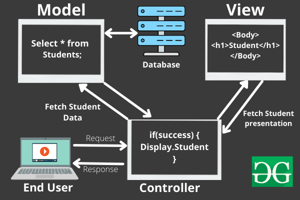

## MVC: Modal View Controller

- If we include everything in index.js then it will take time during loading as because it will going to read each and every statement irrespective of their relevance

- So, to prevent this we use **MVC** which has three parts:-

1. Modals:
   It represents the basic structure of how the backend
2. Views:
   It is the one which contains all the UI forms like things
3. Controllers:
   They are the ones which helps in controlling the routes

- Routes:-
  These are the ones which helps in routing the different routes

## MVC Architecture:

