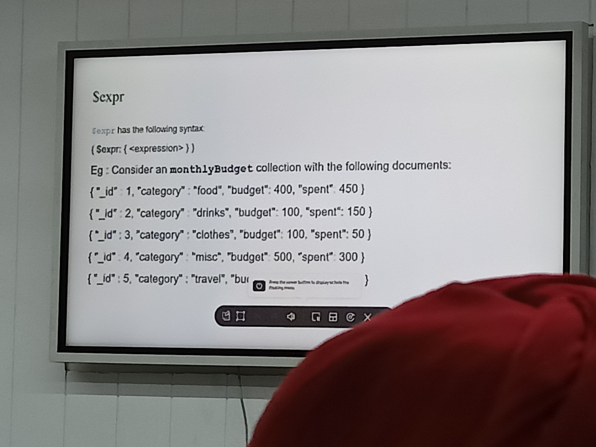
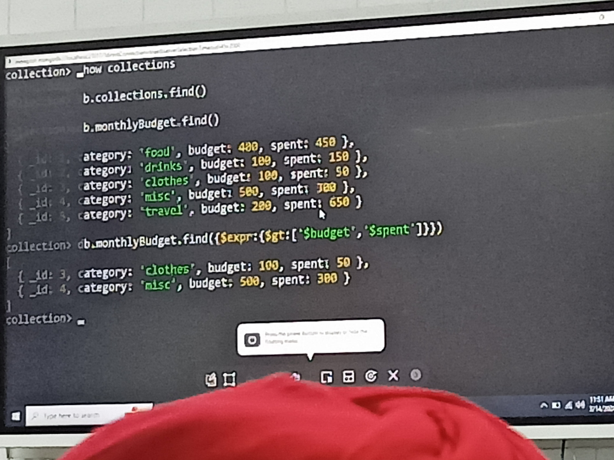
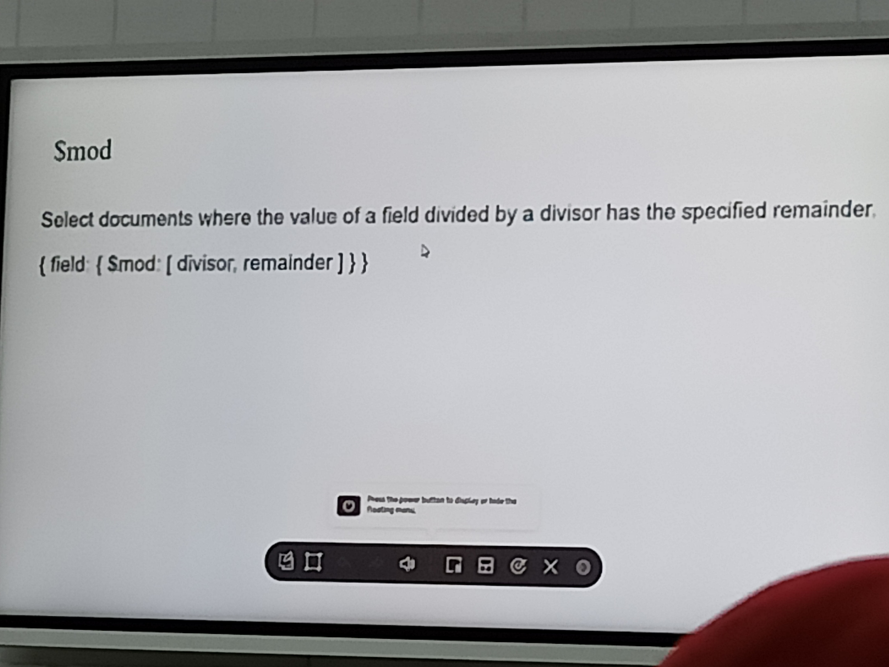
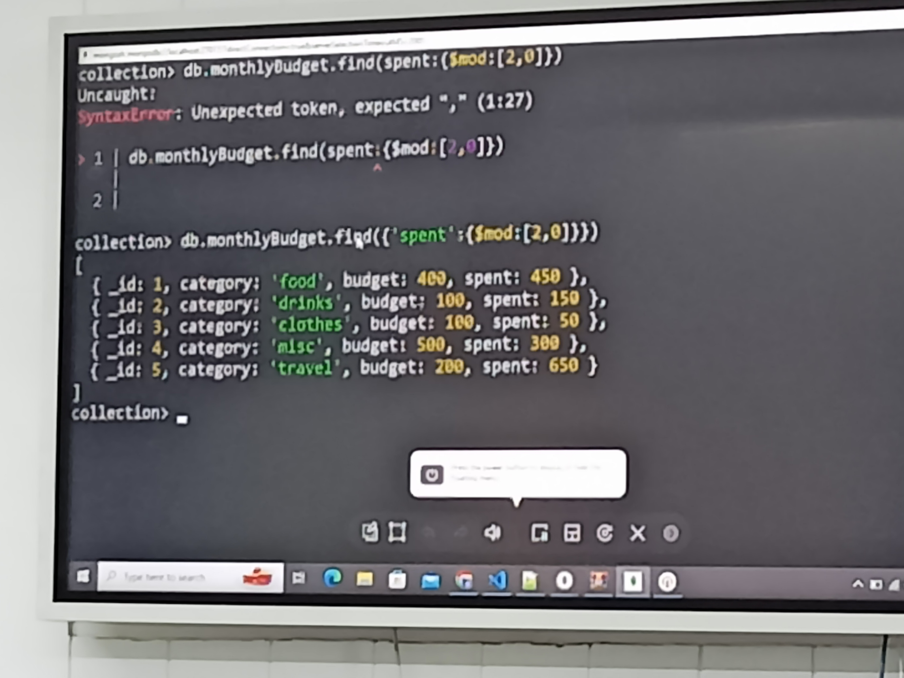
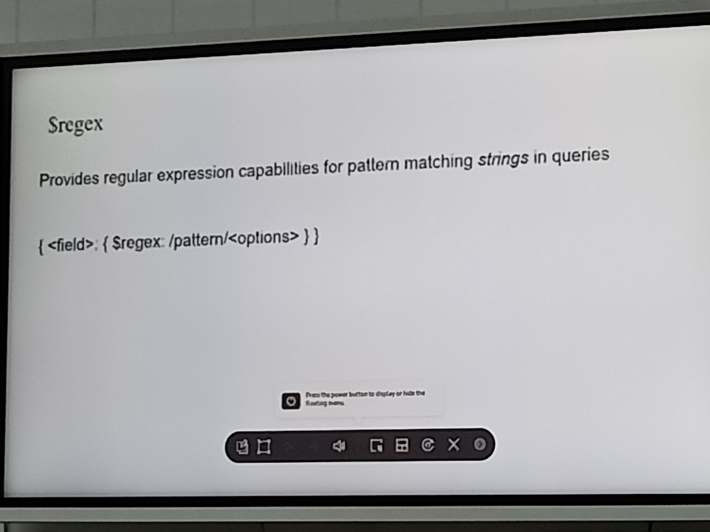
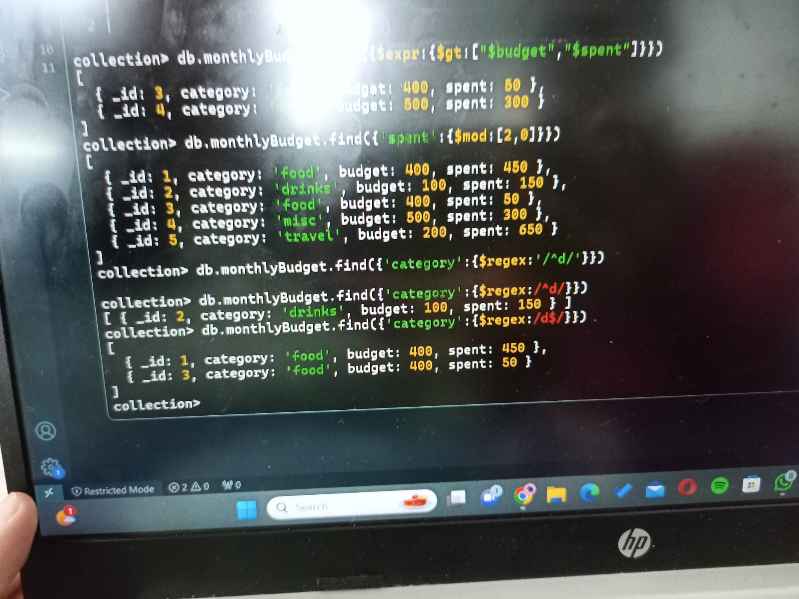
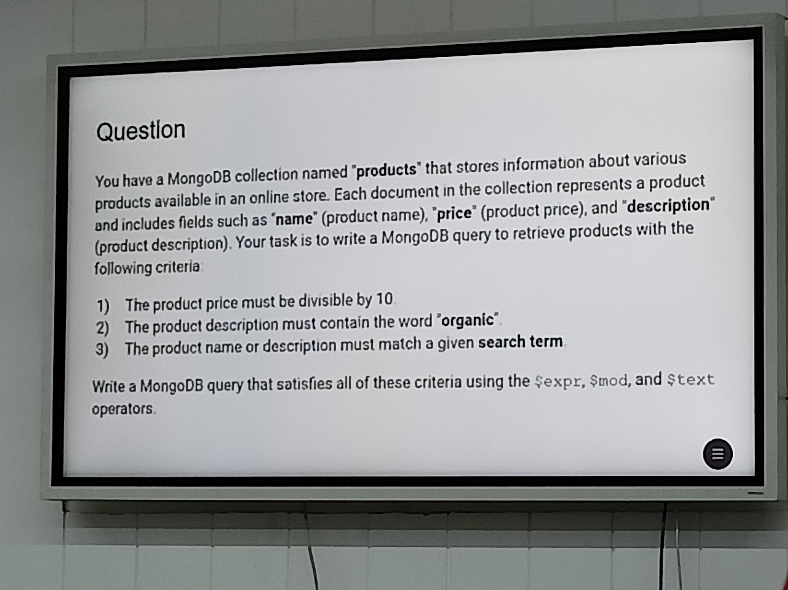
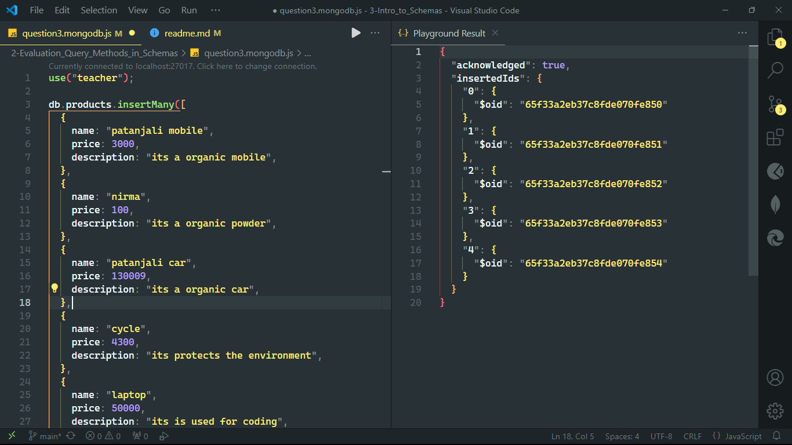
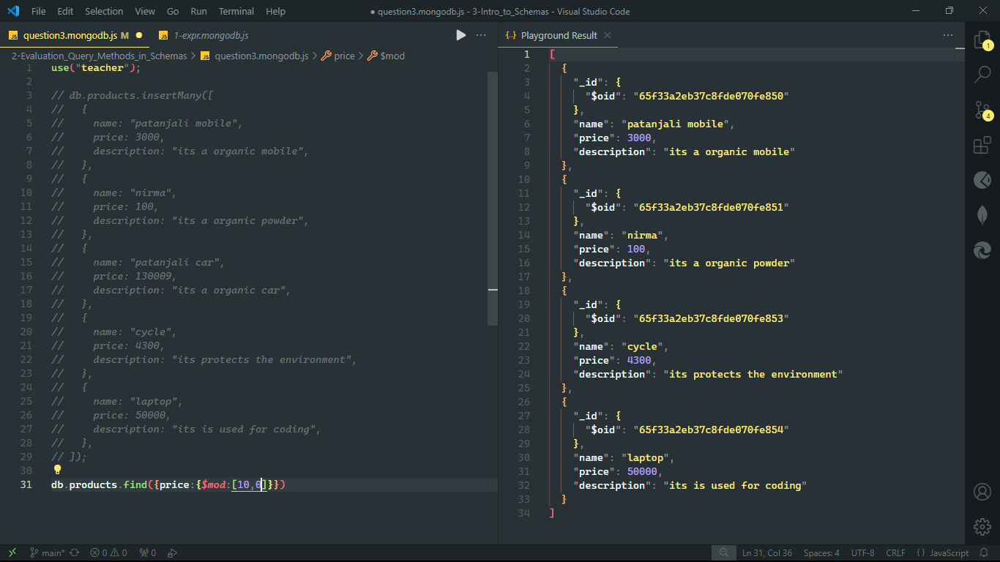
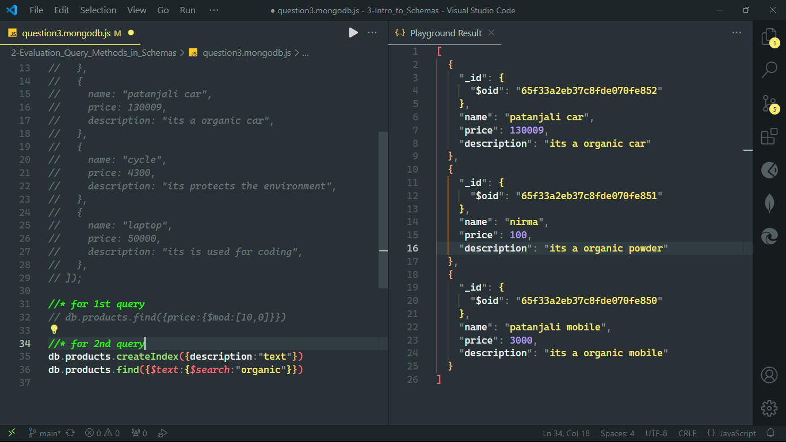

(https://www.mongodb.com/docs/manual/reference/operator/query-evaluation/)

(https://www.mongodb.com/docs/manual/reference/method/js-collection/)

# Evaluation Query Methods:

## 1. expr

## 2. mod

## 3. regex

## 4. text

## Question3:

