(https://www.mongodb.com/docs/manual/reference/operator/query-evaluation/)

(https://www.mongodb.com/docs/manual/reference/method/js-collection/)

# Evaluation Query Methods:

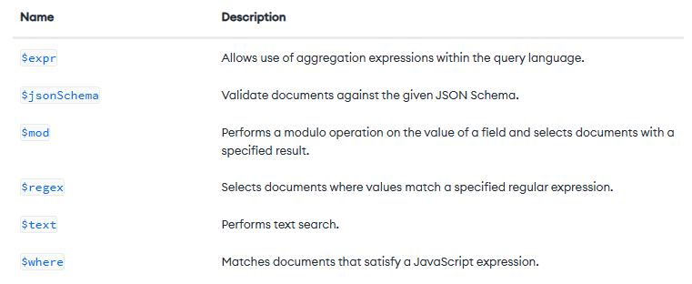

## 1. expr

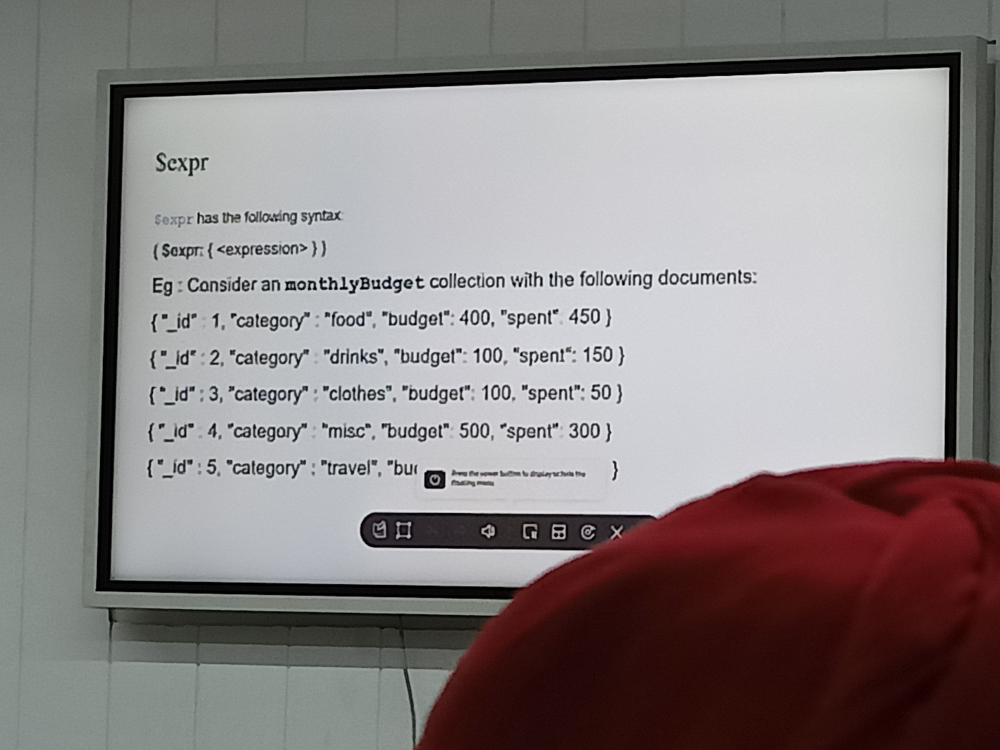
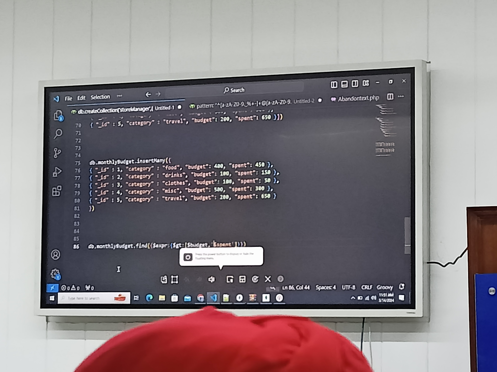
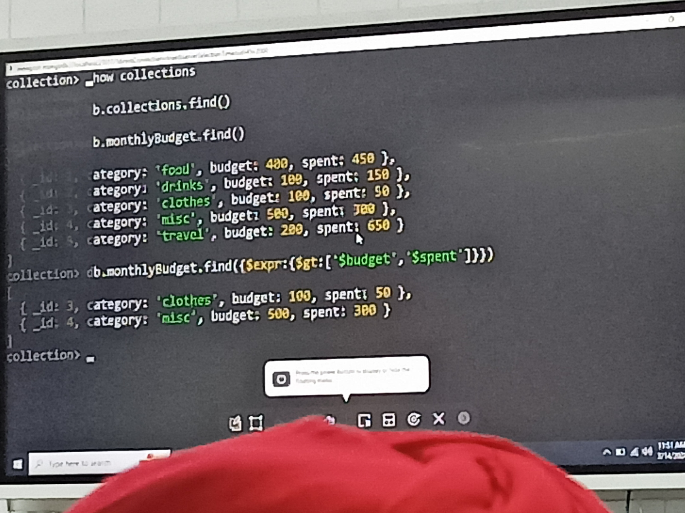

## 2. mod

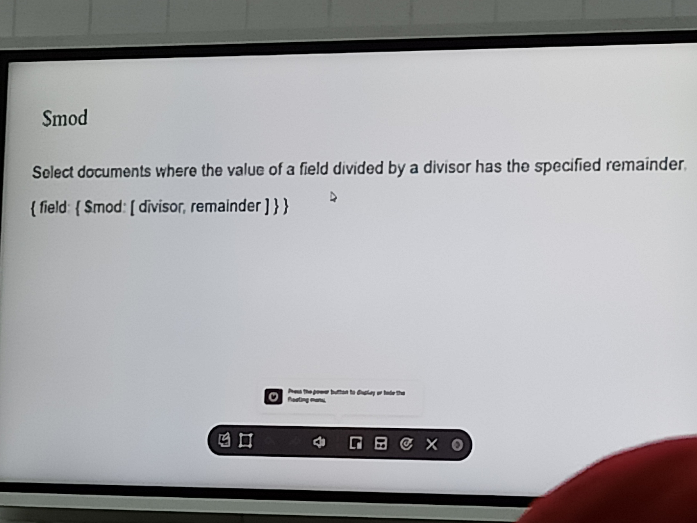
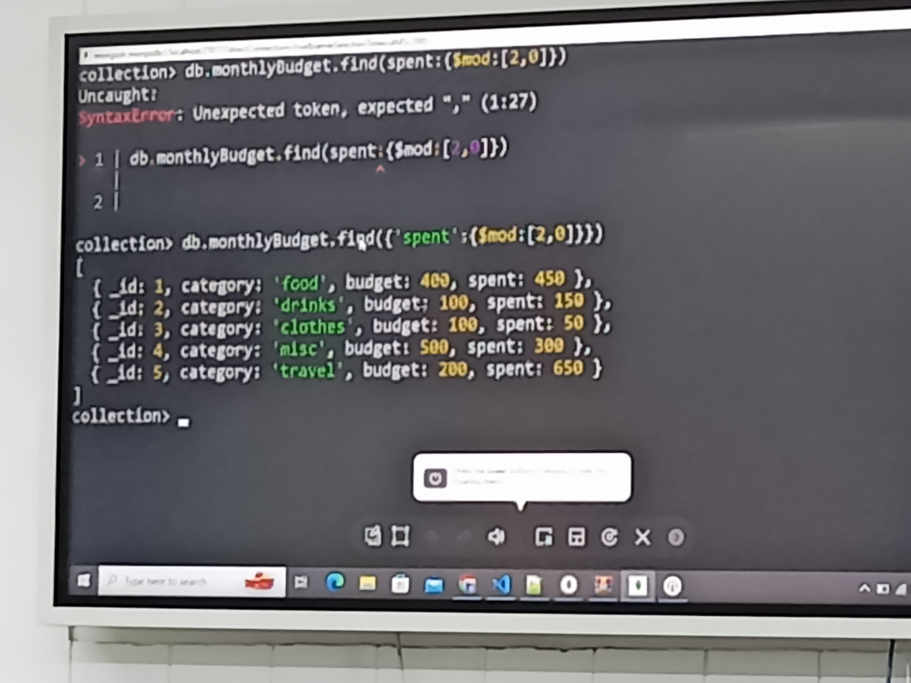

## 3. regex

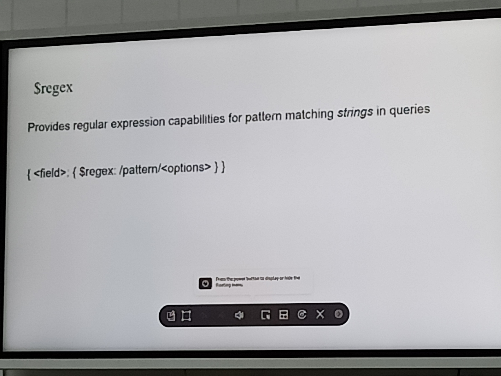
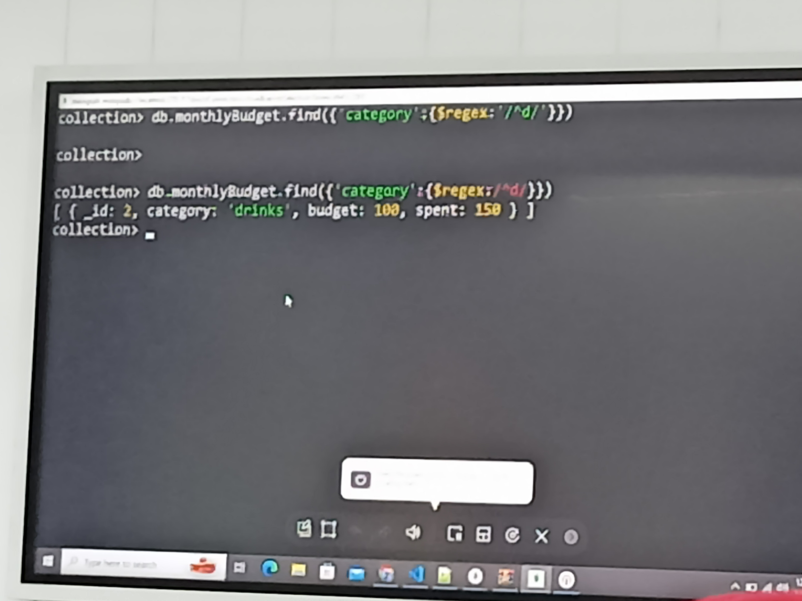
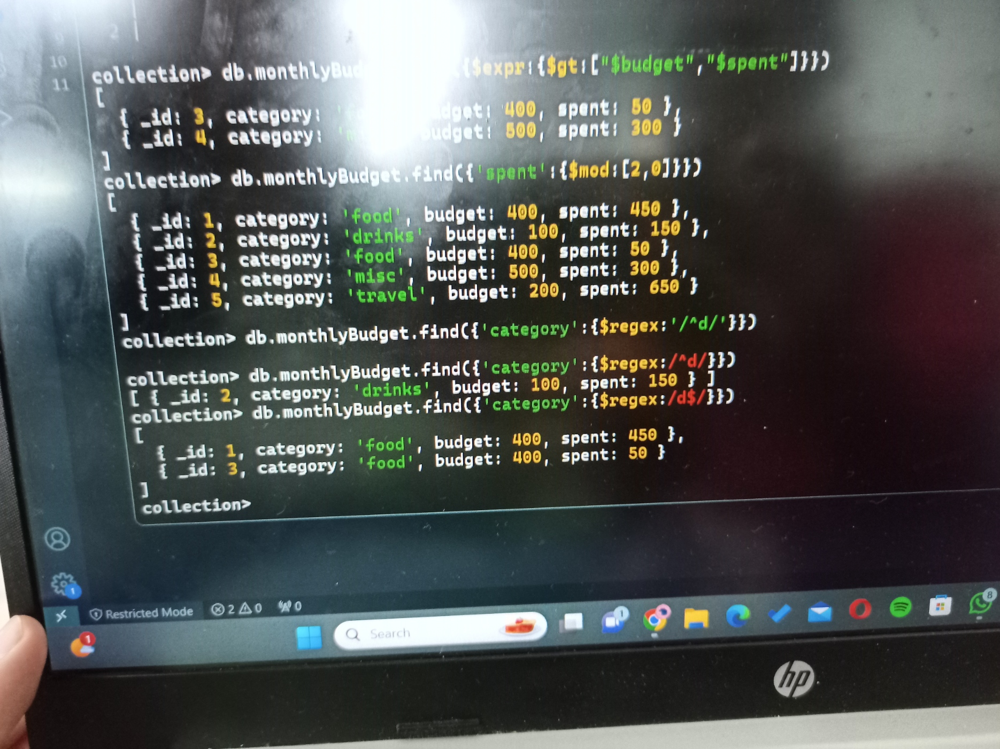

## 4. text

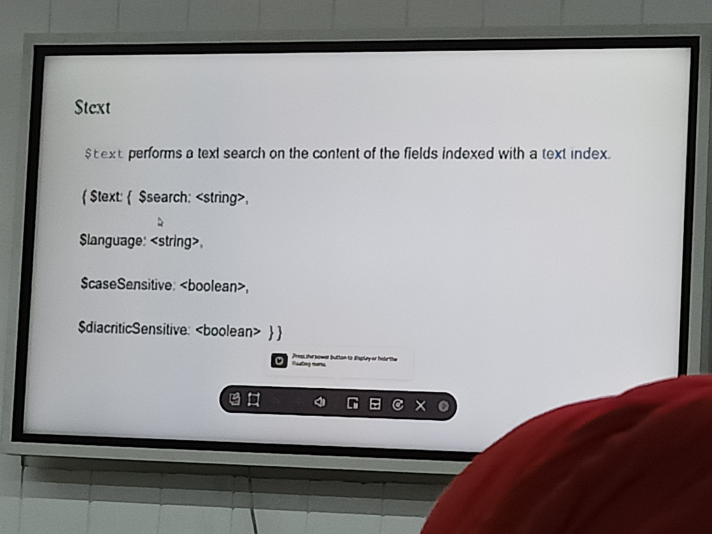
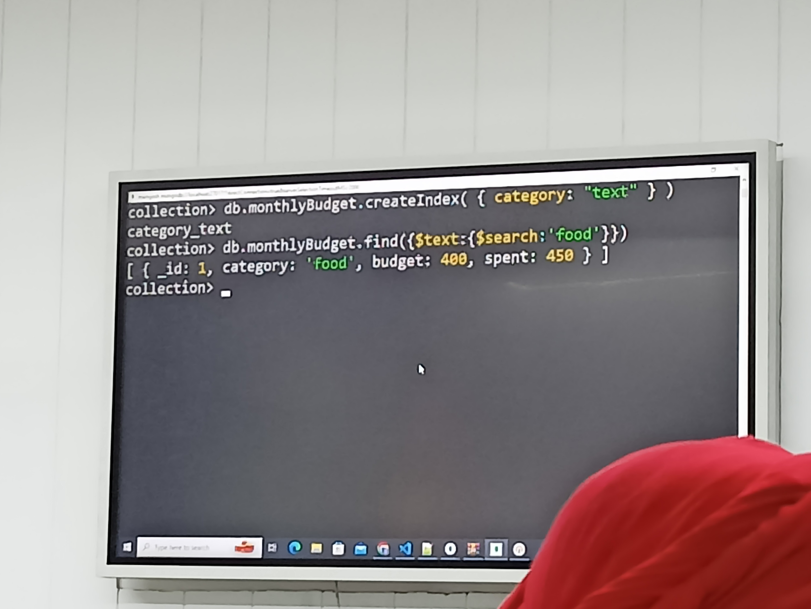

## Question3:

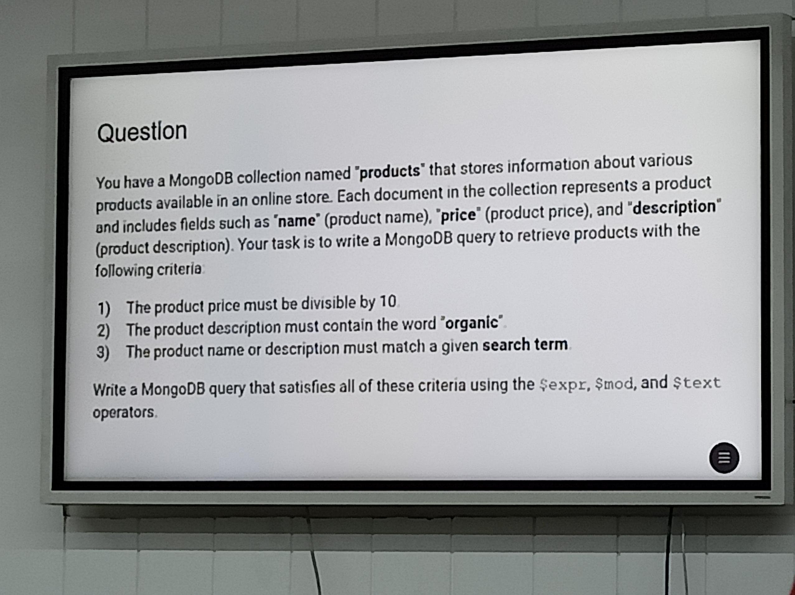
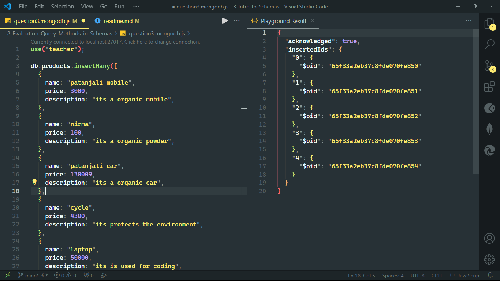
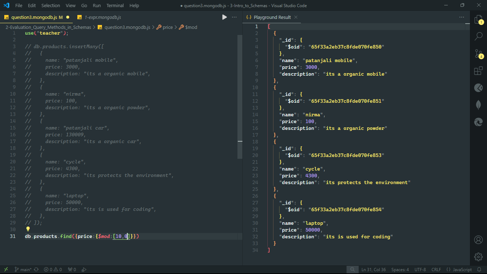
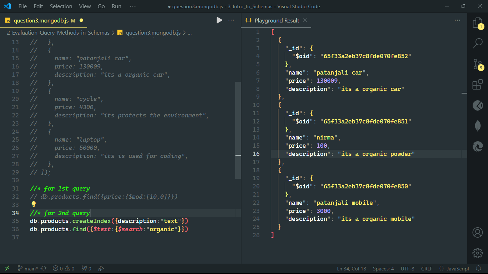
