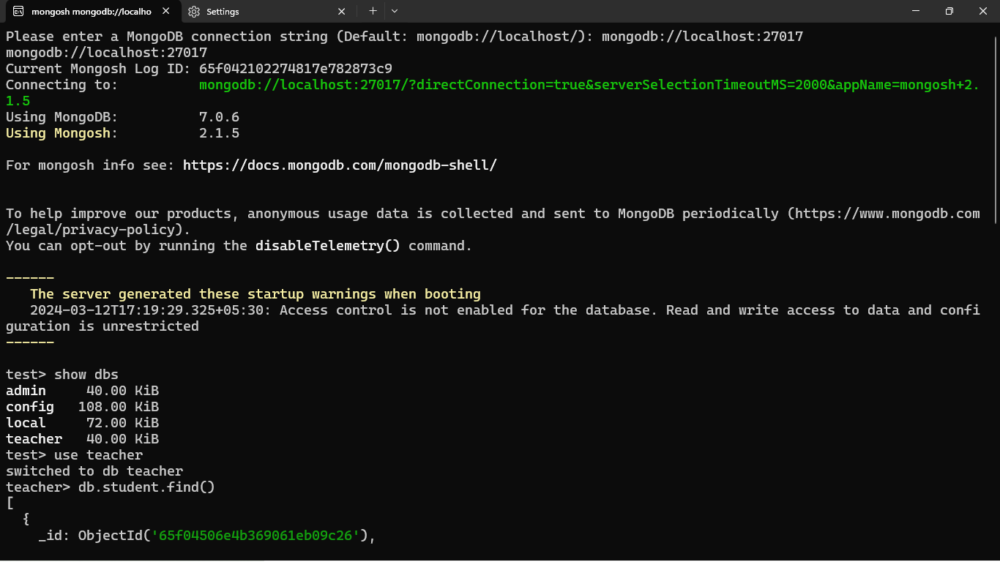
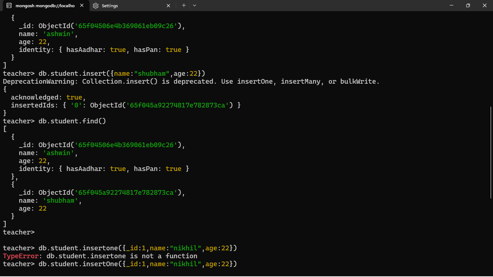
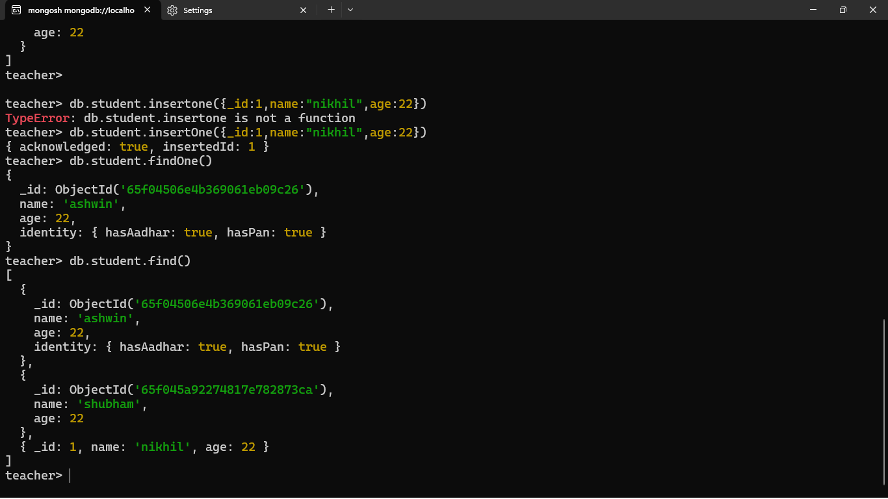
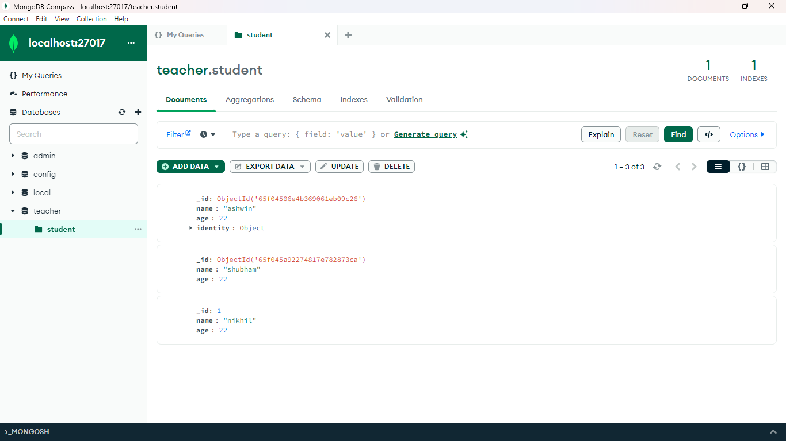
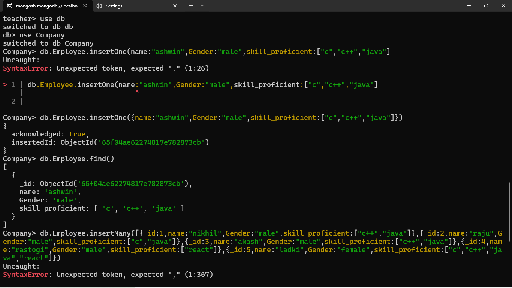
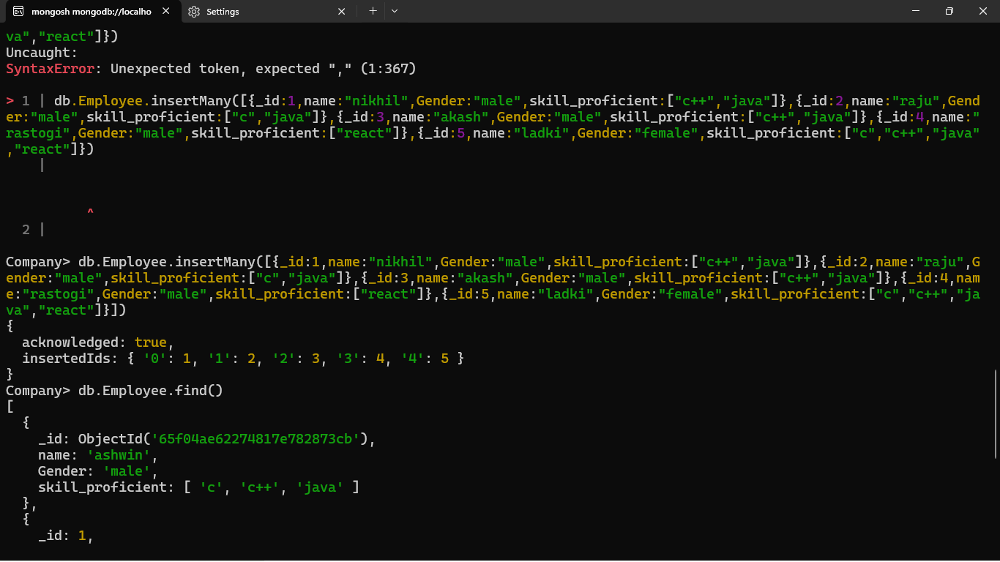
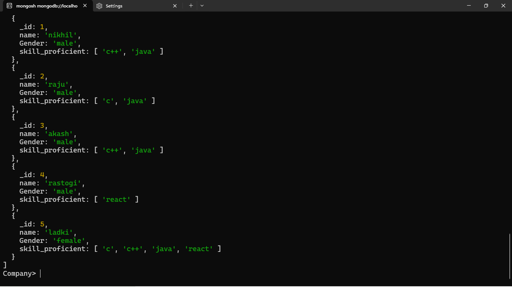
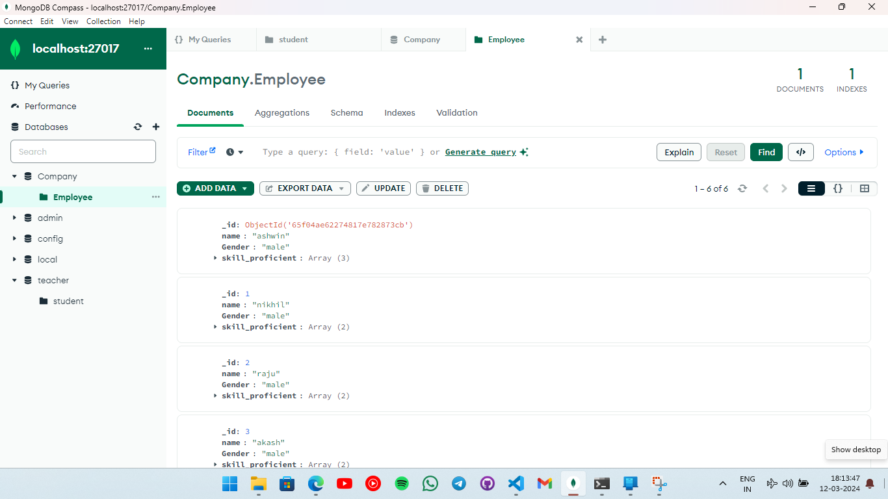
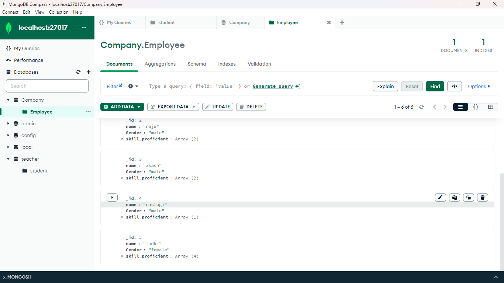

## Mongo DB:

### BSON vs JSON:-

binary for B and javascript for J

### RDBMS vs MONGODB

### How to setup mongodb?

Mongodb download community server
Select packages msi
Download

### Installing:-

Complete

- Download mongodb shell

- Open mongodb campus:-
  Copy the link open mongodb shell.exe from the folder
  and paste the link in the terminal

### Commands:-

show dbs:- for showing
use teacher : to shift into the db teacher
db.student.find():-
db.student.findOne():- for showing only one
db.student.insertOne({name:"ashwin", age:22})
db.student.insert({\_id:1, name:"ashwin", age:22(})

---

db.collection.find():- to search

db.collection.insert():- to insert into

---

---

Q:- Establish a new db name "Company" follow by operation of collection name
"Employees" of 5  
Name, Gender, skill_proficient
and add the fields into it

> 
> 
> 
> 
> 
